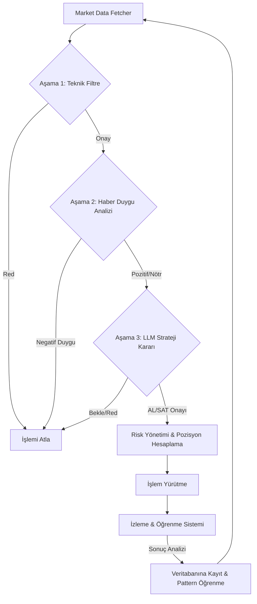

# 🎯 Sniper Trading Bot Algoritması

Bu döküman, botun piyasa verilerini nasıl analiz ettiğini ve işlem kararlarını hangi kriterlere göre verdiğini açıklar. Sistemin temelinde **"3 Kademeli Sert Filtreleme"** felsefesi yatar.

## 🚀 Genel İş Akışı (Flowchart)

---

## 🛡️ 1. Aşama: Teknik Sert Filtre (Technical Filter)
Hedef, piyasadaki gürültüyü elemek ve sadece matematiksel olarak potansiyeli yüksek olan varlıkları seçmektir.
- **Görev**: RSI, MACD, Hareketli Ortalamalar (EMA) ve Bollinger Bantları gibi indikatörleri analiz eder.
- **Kural**: Eğer teknik veriler %70'in altında bir güven skoru veriyorsa varlık anında elenir (GPU/LLM kullanılmaz, sistem hızı korunur).
- **Çıktı**: İşlem yönü (BUY/SELL) ve teknik güven skoru.

## 📰 2. Aşama: Haber Duygu Analizi (News & Sentiment Filter)
Teknik sinyalin, temel veriler tarafından desteklenip desteklenmediğini kontrol eder.
- **Görev**: Son 24 saatteki ekonomik haber başlıklarını ve ekonomik takvimi (Economic Calendar) tarar.
- **Kural**: Eğer teknik sinyal "AL" ise ama haberler çok negatifse veya o varlık için kritik bir faiz kararı/veri açıklaması yakınsa işlem riskli kabul edilir.
- **Çıktı**: Duygu skoru (-1 ile +1 arası) ve yaklaşan önemli olaylar.

## 🧠 3. Aşama: LLM Strateji Kararı (AI Decision Engine)
Sistemin "beyni"dir. Teknik ve temel verileri birleştirerek bir trader mantığıyla son kararı verir.
- **Görev**: Gemini veya Ollama kullanarak verileri analiz eder. RAG (Retrieval-Augmented Generation) kullanarak benzer geçmiş pattern'ları hatırlar.
- **Kural**: AI'dan sadece AL/SAT değil, aynı zamanda Giriş, Kar Al (TP) ve Zarar Kes (SL) seviyelerini belirlemesi istenir.
- **Kritik Kontrol**: AI'nın güven skoru (Confidence) belirlenen barajın altındaysa "BEKLEMEDE KAL" kararı verilir.

---

## ⚖️ Risk Yönetimi (Risk Management)
Karar onaylandıktan sonra sermaye koruma kuralları devreye girer:
1. **Dinamik Lot Hesaplama**: Kasanın %10'u riske edilir.
2. **Kaldıraç & Margin Kontrolü**: Mevcut boş bakiyeniz (Free Balance) işlem açmak için yeterli değilse sistem işlemi reddeder.
3. **Mesafe Kontrolü**: Giriş fiyatı ile SL arasındaki mesafe, kasanın batmasına neden olmayacak kadar küçük, stratejiye uyacak kadar geniş tutulur.

## 📈 Öğrenme Sistemi (Learning System)
Bot her işlem sonucundan bir ders çıkarır:
- İşlem kapandıktan sonra **WIN** veya **LOSS** olarak işaretlenir.
- Başarılı ve başarısız örnekler SQL veritabanında saklanır.
- AI, bir sonraki analizde bu başarılı pattern'ları "referans" olarak kullanır.

---

## 📋 Dashboard ve İzleme
Tüm bu süreç dashboard üzerinden anlık olarak izlenebilir:
- **Pozisyon Planı**: AI'nın o anki stratejik düşüncesini gösterir.
- **Canlı Senkronizasyon**: Her 5 saniyede bir fiyatlar ve bakiye bilgisi güncellenir.
- **Mükerrer Kayıt Filtresi**: Aynı karar üst üste geldiğinde (Örn: Sürekli Bekle mesajı) ekran kirliliğini önlemek için sadece değişiklikler yansıtılır.
