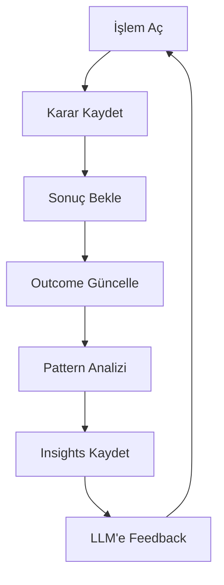

# 🧠 Self-Learning System - Kullanım Rehberi

## 🎯 Özellik: Zamanla Kendi Kendini Geliştiren Bot

Bot artık **her işlem sonucunu kaydeder** ve **başarılı pattern'leri öğrenir**!

---

## 📊 Nasıl Çalışır?

### 1. Her İşlem Kaydedilir

Bot her karar verdiğinde şunları kaydeder:
- Teknik sinyaller (RSI, MACD, Trend)
- Haber sentiment
- LLM confidence
- Entry, SL, TP seviyeleri
- Reasoning

### 2. Sonuçlar Güncellenir

İşlem kapandığında:
- WIN / LOSS / BREAKEVEN
- Kâr/Zarar (pip ve para)
- Kapanış fiyatı

### 3. Pattern'ler Analiz Edilir

Bot düzenli olarak geçmiş işlemleri analiz eder:
- Hangi trend kombinasyonları başarılı?
- Hangi confidence seviyeleri daha iyi?
- Haber sentiment etkisi ne?

### 4. LLM'e Feedback Verilir

Sonraki kararlarda:
```
🧠 LEARNED PATTERNS:
- Trend Pattern: H1=BULLISH, H4=BULLISH, D1=BULLISH
  Win Rate: 75% (12 trades)
  Avg Win: 45 pips

LLM: "Bu pattern geçmişte başarılı olduğu için confidence artırıyorum → 95%"
```

---

## 💾 Veri Tabanı

### Konum:
```
database/learning.db
```

### Tablolar:

**1. trade_history** - Tüm işlemler
- Karar verileri
- Sonuçlar
- Pattern bilgileri

**2. learning_insights** - Öğrenilen pattern'ler
- En başarılı kombinasyonlar
- Win rate istatistikleri

---

## 🔧 Kullanım

### Otomatik (Önerilen)

Bot zaten entegre! Hiçbir şey yapmanız gerekmez:
- Her işlem otomatik kaydedilir
- LLM otomatik olarak learned patterns kullanır

### Manuel Pattern Analizi

```bash
# Python console'da:
python

from utils.learning_system import TradePerformanceTracker

tracker = TradePerformanceTracker()

# Pattern'leri analiz et
patterns = tracker.analyze_patterns(min_samples=5)
print(patterns)

# Performans istatistikleri
stats = tracker.get_performance_stats(days=30)
print(stats)
```

Çıktı örneği:
```python
{
    'total_trades': 25,
    'win_rate': 68.0,
    'wins': 17,
    'losses': 8,
    'avg_win_pips': 42.5,
    'avg_loss_pips': -25.3,
    'avg_confidence': 93.2
}
```

---

## 📈 İşlem Sonuçlarını Güncelleme

### DRY_RUN Modunda (Manuel)

```python
from utils.learning_system import TradePerformanceTracker

tracker = TradePerformanceTracker()

# İşlem sonucunu kendiniz girin
tracker.update_trade_outcome(
    trade_id=1,
    outcome='WIN',
    profit_pips=35.5,
    profit_amount=355.00,
    close_price=1.2685
)
```

### LIVE Modunda (Otomatik)

Gelecek güncelleme: MT5'ten otomatik sonuç çekme

---

## 🧪 Test Senaryosu

### 1. İlk Hafta (Öğrenme Başlıyor)

```
📝 Trade 1: EURUSD BUY → Kaydedildi
📝 Trade 2: GBPUSD SELL → Kaydedildi
📝 Trade 3: XAUUSD BUY → Kaydedildi
...

Henüz yeterli veri yok, LLM sadece RAG kullanıyor
```

### 2. İkinci Hafta (Pattern'ler Belirleniyor)

```
🧠 10+ işlem tamamlandı
🧠 Analiz başladı...
🧠 Pattern bulundu:
   - H1+H4+D1 BULLISH → %75 win rate
```

### 3. Üçüncü Hafta (Self-Learning Aktif)

```
LLM'e gönderilen prompt:

"🧠 LEARNED PATTERNS:
- Trend Pattern: All BULLISH → 75% win (12 trades)
- Confidence 95+: 80% win (8 trades)"

LLM: "Bu setup geçmiş verilerle eşleşiyor, confidence 95%"
✅ İşlem daha iyi kararlarla açılıyor!
```

---

## 📊 Performans Takibi

### Dashboard (Gelecek)

Şu an manuel sorgu, gelecekte web dashboard:

```python
# Trend bazlı performans
SELECT trend_h1, trend_h4, trend_d1, 
       COUNT(*) as trades,
       AVG(CASE WHEN outcome='WIN' THEN 1 ELSE 0 END)*100 as win_rate
FROM trade_history
WHERE outcome IN ('WIN', 'LOSS')
GROUP BY trend_h1, trend_h4, trend_d1
ORDER BY win_rate DESC;
```

---

## ⚙️ Ayarlar

### Minimum Sample Size

```python
# utils/learning_system.py
def analyze_patterns(self, min_samples=10):
```

- `min_samples=5`: Daha hızlı öğrenir, az veriyle karar
- `min_samples=20`: Daha güvenilir, ama yavaş

### Win Rate Threshold

```python
if win_rate >= 60:  # Sadece %60+ pattern'leri öğren
```

- `>= 50`: Daha fazla pattern, ama az güvenilir
- `>= 70`: Sadece çok başarılı pattern'ler

---

## 🎓 Öğrenme Döngüsü



---

## 🚀 Gelecek Geliştirmeler

- [ ] Otomatik MT5 sonuç çekme
- [ ] Web dashboard
- [ ] A/B testing (learned patterns ile/siz karşılaştırma)
- [ ] Machine learning model (LSTM/Random Forest)
- [ ] Sentiment analizi iyileştirme

---

## 💡 İpuçları

1. **En az 20 işlem** sonucunu girin (DRY_RUN modunda manuel)
2. **Düzenli analiz yapın** (haftada 1)
3. **Başarılı pattern'leri** not edin
4. **Confidence artışını** gözlemleyin

---

**Bot artık kendi tecrübesinden öğreniyor! 🧠✨**
